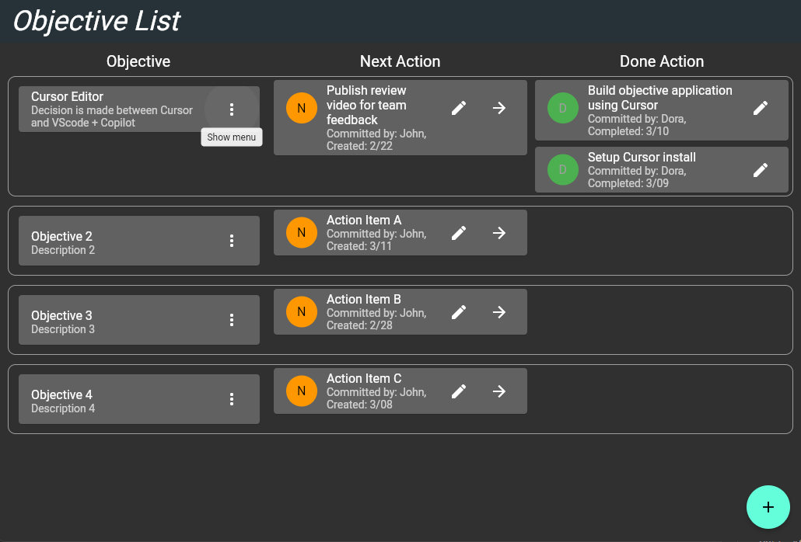

# Objective List

Objective List is as Flutter application for communicating and achieving objectives - especially on teams. 
- Prioritize your objectives
- Track the Next Actions that will advance that vision
- Celebrate Done Actions that have been completed.
Currently an MVP without database connectivity. Tested as a web application.

# Features
- Create / Edit / Delete Objectives
- Add / Edit / Mark Done Actions for each objective
- Change the priority order of Objectives

# Philosophy

Transparent Communication: Clearly define and share objectives, actions, and progress to ensure everyone is aligned and informed.
Active Participation: Engage all team members in the process, from setting objectives to celebrating achievements.
Adaptive Planning: Allow the scope of objectives to evolve, reflecting on what's achieved and what needs to be adjusted.
Celebration of Progress: Recognize and celebrate every step forward, big or small, to foster a positive team culture.

# Suggested Use

The philosophy behind Objective is to create a transparent, engaging, and efficient environment for teams to manage their objectives and celebrate their accomplishments. Here's a brief guide on how the app should be used, along with definitions for key terms:

Objective: A specific goal or project the team aims to achieve. It's defined by a clear name, description, and a set of actions required to reach completion.

Name and Description: Should be concise, memorable, and provide a clear understanding of the objective's purpose.
Actions: Small, manageable tasks that collectively lead to the completion of an objective.
Communication of Status: Objective uses a shared platform to visualize the progress of each objective, minimizing the need for repetitive status updates.

Views: Tailored perspectives (Everything view, Update view, Person view) allow users to see relevant objectives based on their role or updates.
Color Highlighting: Changes in objectives or actions are visually represented, making it easy to track progress and updates at a glance.
Celebration of Wins: When an objective is completed, it's celebrated as a win, acknowledging the team's effort and success. Objectives can be revisited and re-added if necessary, emphasizing continuous improvement.

Ownership and Commitment: Assigning actions requires the consent of the individual, fostering a sense of ownership and accountability without micromanagement.

Next Action: Every objective must have a designated next action to maintain momentum.
Last Action: Captures the most recent step taken towards completing an objective, ensuring progress is recorded.
Continuous Improvement: The app encourages teams to reflect on their processes and objectives, aiming for iterative refinement and efficiency over time.

Integration and Accessibility: Features like deep-linked URLs allow for seamless integration with other systems and easy navigation within the app.

## Getting Started

To run this application as a demo:
1. Ensure Flutter is Installed: First, make sure that Flutter is installed on your system. You can check this by running flutter doctor in the terminal or command prompt. If Flutter is not installed, you need to install Flutter.
2. Get the Application Code: If you haven't already, you need to obtain the source code of the application. This might involve cloning a repository from GitHub or another version control system.
3. Navigate to the Project Directory: Open a terminal or command prompt and navigate to the root directory of the project (where the pubspec.yaml file is located).
4. Get Dependencies: Run *flutter pub get* to fetch all the dependencies required by the project.
5. Run the Application:
For web applications (like the one you're asking about), you can use *flutter run -d chrome* to run the application in Chrome. You can replace chrome with another supported browser if needed.
If you're working with an IDE like Visual Studio Code or Android Studio, you can also use the built-in Flutter tools to run the application.
6. Accessing the Demo: Once the application is running, it will be served on a local server (usually something like http://localhost:8080). You can open this URL in your web browser to view and interact with the application.
7. Building for Deployment: If you want to create a build of the application for deployment, you can use flutter build web. This will generate a build/web directory with the production version of your app, which you can then deploy to a web server. Remember to set the --base-href argument if you are serving your app from a path other than the root.